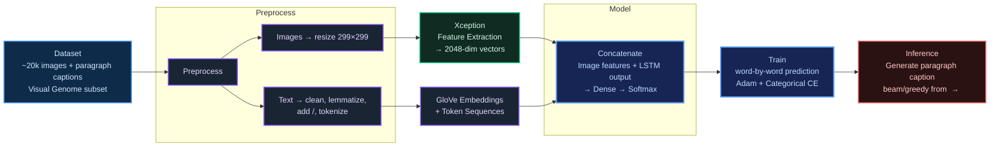

# 🖼️ Image Paragraph Captioning using Xception and LSTM
Developed a model leveraging the Xception architecture on a subset of the Visual Genome dataset containing ~20k images paired with paragraph captions. The project focuses on understanding complex image features to generate detailed descriptive captions for each image.


## 🔍 Objective

The goal of this project is to build a deep learning model capable of generating **descriptive paragraphs** for images. Unlike traditional captioning models that generate short phrases, this model attempts to describe an image in multiple lines of natural language by learning visual and linguistic patterns from annotated data.

---

## 📊 Dataset

This project uses [Stanford Image Paragraph Captioning Dataset
](https://www.kaggle.com/datasets/vakadanaveen/stanford-image-paragraph-captioning-dataset) a subset of the **Visual Genome dataset**, which contains around **20,000 images**, each labeled with a **descriptive paragraph**. For training purposes, we use a subset of **5,000 image-paragraph pairs**.

Each image is associated with a paragraph caption that acts as a training label.

---

## 🛠️ Workflow


## 🧹 Step 1: Data Preprocessing

### 1.1 Load and Organize

- Loaded `captions.csv` containing image names and paragraph descriptions.
- Selected the first 5,000 rows.
- Sorted data by image names and reset indices for alignment.

### 1.2 Resize Images

- Resized all images to **299x299 pixels** to match the Xception model's input requirement.
- Converted each image to a NumPy array.

---

## 🧠 Step 2: Feature Extraction using Xception

### 2.1 Load Pretrained Model

- Loaded **Xception**, pretrained on ImageNet (`include_top=True`).
- Extracted features from the `avg_pool` layer, resulting in a **2048-dimensional** vector per image.

### 2.2 Feature Dictionary

- Stored image features in a dictionary with image filenames as keys.
- Saved the dictionary using Pickle (`xc_features.pkl`).

---

## 📝 Step 3: Text Preprocessing

### 3.1 Clean and Lemmatize

- Removed punctuation and stopwords using `nltk`.
- Converted all text to lowercase.
- Lemmatized text using SpaCy’s `en_core_web_trf` model.

```
def caption_preprocessing(captions):
    
    # Load the spacy lemmatizer
    lemmatizer = spacy.load('en_core_web_trf')

    # Create an empty list to store lemmatized captions
    lemma_sent_list = []

    # Remove punctuations from ecah caption
    for sent in tqdm(captions):    
        sentence = re.sub(pattern = r'[^\w\s]', repl = '', string = sent)

        # Converting to lowercase
        sentence = sentence.lower()

        # Removing stopwords
        stop_words_removed = ''
        for word in sentence.split():
            if word in nltk.corpus.stopwords.words('english'):
                continue
            else:
                stop_words_removed = stop_words_removed + ' ' + word
        stop_words_removed = stop_words_removed.strip() 

        # Lemmatizing using en_core_web_trf
        doc = lemmatizer(stop_words_removed)
        lemma_sent = ''
        for token in doc:
            lemma_sent = lemma_sent + ' ' + token.lemma_
        lemma_sent = lemma_sent.strip()
        lemma_sent_list.append(lemma_sent)

    # Return lemmatized caption list
    return lemma_sent_list
```

### 3.2 Add Tokens

- Appended `<START>` and `<END>` tokens to each cleaned paragraph.
- Constructed a vocabulary corpus from all captions.

---

## 🔠 Step 4: Tokenization and Embeddings

### 4.1 Tokenize Captions

- Used Keras `Tokenizer` to convert the text to sequences.
- Determined:
  - **Vocabulary size**: ~4206 words.
  - **Maximum caption length**: 106 tokens.

### 4.2 Create Embedding Matrix

- Loaded **GloVe 50d vectors** from [GloVe 50D embeddings](https://nlp.stanford.edu/data/glove.6B.zip).
- Created an embedding matrix using these vectors.
- Saved as `embedding_matrix.pkl`.

---

## 📦 Step 5: Dataset Preparation

### 5.1 Data Generator

- Created a function to:
  - Convert each caption to multiple `(input_seq, output_word)` pairs.
  - Align each pair with its corresponding image feature.

```
def data_generator(descriptions, features, tokenizer, max_length, vocab_size):
    temp_list = []
    for key, desc_list in descriptions.items():
        temp_list.append(desc_list)
    x1, x2, y = [], [], []
    max_seq_value = 0
    for desc in temp_list:
        seq = tokenizer.texts_to_sequences([desc])[0]
        for i in range(1,len(seq)):
            in_seq, out_seq = seq[:i], seq[i]
            in_seq = pad_sequences([in_seq], maxlen = max_length)[0]
            out_seq = to_categorical([out_seq], num_classes = vocab_size)[0]
            x1.append(features[key][0])
            x2.append(in_seq)
            y.append(out_seq)

    return [[np.array(x1), np.array(x2)], np.array(y)]
```

### 5.2 Final Shapes

- Image features: `(83629, 2048)`
- Token sequences: `(83629, 106)`
- Labels (one-hot): `(83629, 4207)`

---

## 🧩 Step 6: Model Architecture

### 6.1 Dual Input Model

- **Image Input**: Dense layer with Dropout on 2048-dim vector.
- **Text Input**: Embedding layer + LSTM with Dropout.
- Concatenated both outputs.
- Final Dense layers with softmax output over vocabulary.

### 6.2 Compile Model

- Optimizer: `Adam`
- Loss: `categorical_crossentropy`
- Trained for **3 epochs** with **batch size = 16**

```
def define_model(vocab_size, max_length, embedding_matrix):
    # feature extractor model
    inputs1 = Input(shape = (2048,))
    image_feature = Dropout(0.5)(inputs1)
    image_feature = Dense(256, activation = 'relu')(image_feature)
    # sequence model
    inputs2 = Input(shape = (max_length,))
    language_feature = Embedding(vocab_size, 256, mask_zero = True)(inputs2)
    language_feature = Dropout(0.5)(language_feature)
    language_feature = LSTM(256)(language_feature)
    # Concatination
    output = concatenate([image_feature, language_feature])
    output = Dense(256, activation = 'relu')(output)
    output = Dense(vocab_size, activation = 'softmax')(output)
    # Define final model
    model = Model(inputs = [inputs1, inputs2], outputs = output)
    model.compile(optimizer = 'adam', loss = 'categorical_crossentropy', run_eagerly = True)
    print(model.summary())
    return model


caption_max_length = max_cap_ln
vocab_size = len(tokenizer.index_word) + 1
concat_model = define_model(vocab_size, caption_max_length, embedding_matrix)
```

---

## 🏋️ Step 7: Model Training

- Trained the model using the custom data generator.
- Used Keras `ModelCheckpoint`, although saving best model was skipped due to `val_loss` absence.
- Final model saved as `models/model_1.h5`.

---

## 🧪 Step 8: Inference

### 8.1 Caption Generator

- Function `generate_caption()`:
  - Starts with `<START>` token.
  - Predicts next word using the trained model.
  - Stops on `<END>` or max length.

```
def generate_caption(pred_model, tokenizer, image, max_length):
    in_text = '<START>'
    caption_text = []
    for i in range(max_length):
        seq = tokenizer.texts_to_sequences([in_text])[0]
        # pad input
        seq = pad_sequences([seq], maxlen = max_length)
        # predict next word
        out = pred_model.predict([image,seq], verbose = 0)
        # convert probability to integer
        word_index = np.argmax(out)
        # map integer to word
        word = tokenizer.index_word[word_index]
        # stop if cannot map the word
        if word is None:
            break
        # append as input for generating next word
        in_text = in_text + ' ' + word
        # stop if the prediction is end
        if word != 'end':
            caption_text.append(word)
        if word == 'end':
            break
    return caption_text
```

### 8.2 Sample Output

For an image of a man wearing a black shirt:

```
man wear black shirt black shirt hold white umbrella man wear black shirt
```

While slightly repetitive, the generated output shows the model’s ability to capture visual semantics.

---

## ✅ Summary

This project builds a **deep learning-based paragraph captioning system** by combining:

- **Pretrained CNN (Xception)** for visual feature extraction.
- **LSTM sequence modeling** for language generation.
- **GloVe embeddings** for improved word representations.
- Custom training pipeline to predict **multi-line descriptions** of complex scenes.

## References
- https://xiangyutang2.github.io/image-captioning/

